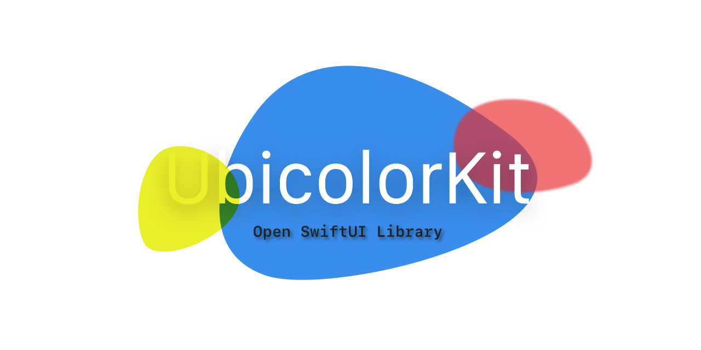

# UbicolorKit

<h3 align="center">

</h3>

This is a SwiftUI components library. it includes useful Views and extensions.

## SwiftUI Views

`ColorPicker(color : $UIColor)`

`ColorSwitch(isOn : $Bool)`

`FlatSlider(progress : Float )`

`ImagePicker(selectedImage: $UIImage)`

`TimeStepper(time: Double)`

`SkeuoSlider(progress: Float)`

## SwiftUI Button Style

`NeoStyle(selected: $Bool, color: $UIColor, style : $ButtonEdgesStyle)`

`enum ButtonEdgesStyle 
    case sharp
    case soft`
    
    

# Extensions

## View

`shadow()`

`doubleShdow()`

`smoothCorners(_ radius: CGFloat = 20))`

`card()`

`lookNice()`

`neo()`

`if(Bool)` //conditional modifier

`maskContent<T: View>(using: T) -> some View` //mask View with another View

## Color

`Color.label`

`Color.secondaryBackground`

## Gradient

Get a gradient of Hues from 0 to 360

`Gradient.spectrum : Gradient` 

## UIColor

Render color as Image

`func image(size: CGSize = CGSize(width: 4, height: 4)) -> UIImage`

Get color information in any format

`var rgba -> (red: CGFloat, green: CGFloat, blue: CGFloat, alpha: CGFloat)`

`var cmyk -> CMYK(cyan: CGFloat, magenta: CGFloat, yellow: CGFloat, black: CGFloat)`

`var hsba : (h: CGFloat, s: CGFloat,b: CGFloat,a: CGFloat)`

UIColor to HEX as String. Example "FFFFFF"

`func getHex() -> String` 

HEX to UIColor

`static func` fromHex (hex:String) -> UIColor`

## UIImage

...because sometimes it has a weird orientation...

`var averageColor: UIColor?`

`func scaled(by scale: CGFloat) -> UIImage?`

`func fixOrientation() -> UIImage`

## UIView

`func renderedImage() -> UIImage`

`func getColor(at point : CGPoint)  -> UIColor?`

# UIImageColors

Includes Image Colors from  https://github.com/jathu/UIImageColors

`UIImageColor(background: UIColor, primary: UIColor, secondary: UIColor, detail: UIColor)`

